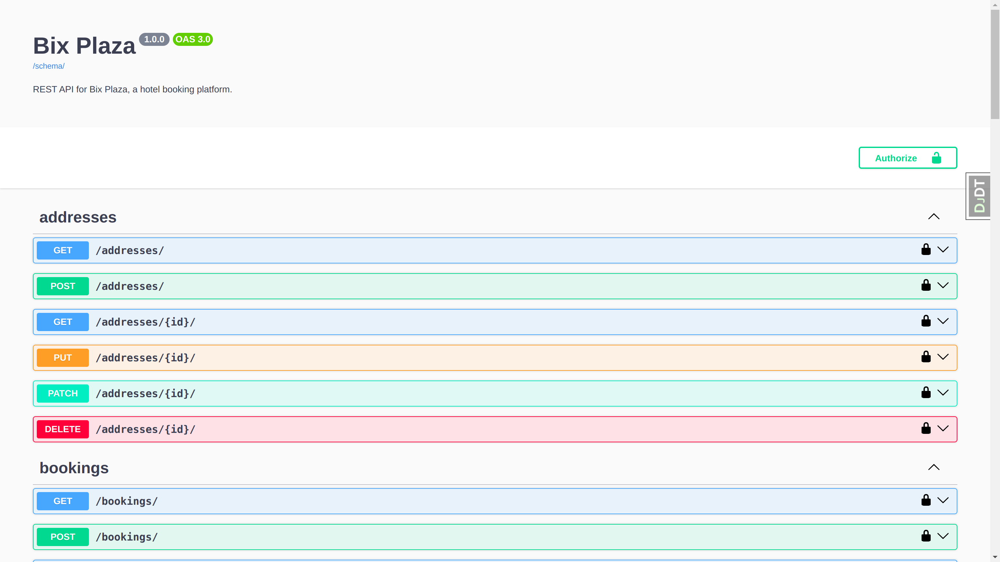

# Bix Plaza

REST API for hotel management and reservations. It was developed during a technical test for a selection process from BIX Tecnologia.



## About

As optional and custom features, I added:

- 80% of test coverage;
- Documentation, including Swagger UI and OpenAPI 3 schema generation;
- Caching with Redis;
- CI workflow to execute the project test suites in the cloud on pushes and pull-requests.

## Requirements

- Docker and Docker Compose (installation guide [here](https://docs.docker.com/compose/install/))

## Installation

In order to install the project locally, run

```bash
# define the compose file
export COMPOSE_FILE=docker-compose.local.yml

# build the containers
docker compose build
```

## Running the app

To run the API in a development environment, execute

```bash
# development
docker compose up
```

now, the resources are available on the [localhost](http://localhost:8010).

## Test

```bash
# Running tests
docker compose exec -it django pdm run test

# Watch for file changes
docker compose exec -it django pdm run test:watch
```
